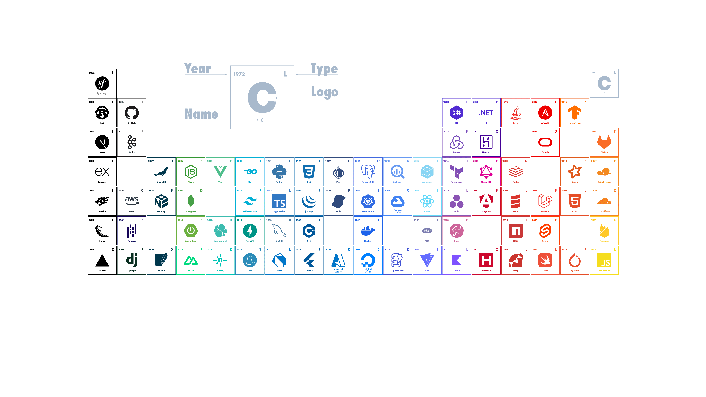

    

    

 <h1>Hey! Nice to see you here </h1>

My name is Andrea, and I'm "your friendly neighborhood Developer".  I'm from  Italy.

As you can see, there are some empty spaces waiting to be filled. If you have suggestions or ideas about which technologies could occupy these vacant spots, I invite you to share your thoughts through my <a href="https://www.linkedin.com/in/andrea-nuzzo-bb1249a1" target="_blank">LinkedIn</a>

<h2> 🔧 Technologies & Tools</h2>

  

<h2> &#x270d; Blog & Writing </h2>

  

    In this space, I will share articles based on the themes that I have faced and resolved during my journey. 
    
Here's what you can expect soon:

    <ul>
    <li><strong>Creating a WordPress Plugin with React:</strong> A Journey Through Integrating React into a WordPress Environment</li>
     
    <li><strong>Embedding Apache Superset in a React Application through Keycloak:</strong> A detailed guide on integrating Apache Superset into a React application, using Keycloak for secure authentication and authorization management.</li>
    </ul>
   

  
<strong>If you have an interest in specific topics or wish to propose suggestions, your participation is warmly welcomed.</strong>

  

  

    
  

<!-- ## 📊 GitHub Stats:

  
  

 -->

<!-- ## 😂 Random Meme
 -->

<h2> Where to find me </h2>

  
 

